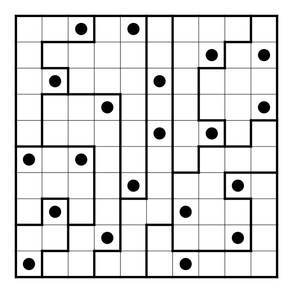
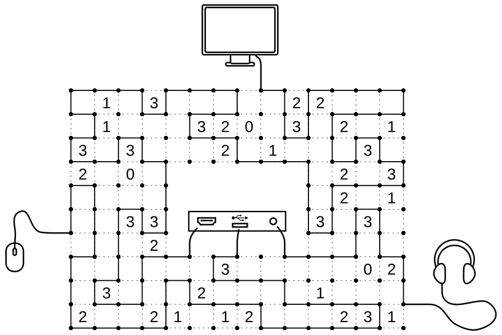
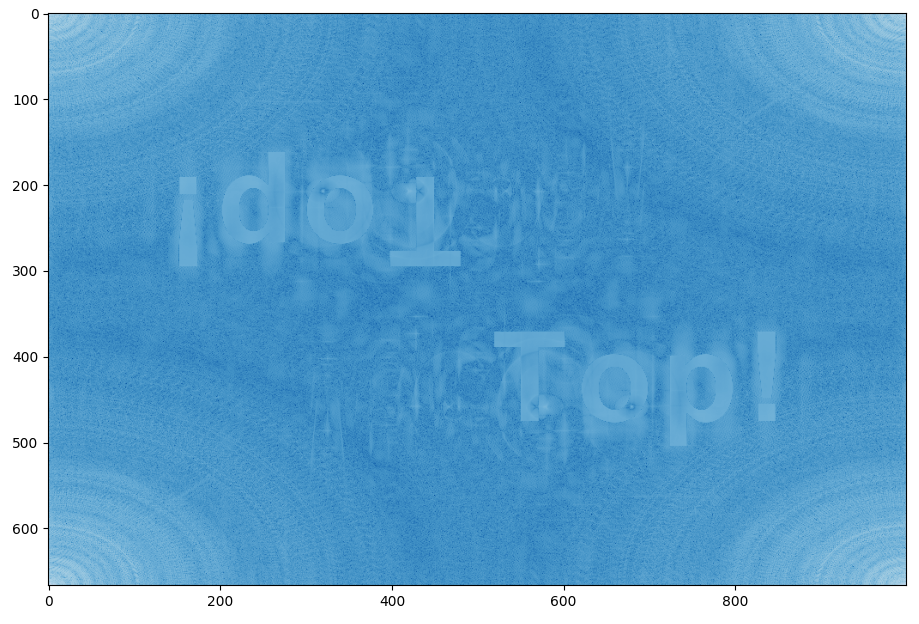

# Festo Coding Challenge 2020 - Solutions

Hi, I am one of the puzzle authors of the Festo Coding Challenge 2020.

Here you can find the code I used to compute the solution codes myself. You can also find the solutions to the logic puzzles and the mystery puzzles here.

All my code is written in python.

## 1-1 Maintenance Man - Five XOR Seven

```python
def is_valid(n):
    s = str(n)
    return ('5' in s) != ('7' in s)

l = []
i = 0
while len(l) < 1000:
    if is_valid(i):
        l.append(i)
    i += 1
        
print('Solution for puzzle 1.1: {}'.format(l[-1]))
```

Solution for puzzle 1.1: **2379**

## 1-2 System Admin - Christmas Cards

```python
import numpy as np
import itertools

d = np.genfromtxt('1_2_christmas_cards.csv', 
                     dtype = int, 
                     delimiter = ',',
                     missing_values = '-',
                     filling_values = -1)

friendlist = np.arange(1,9)
best_length = np.inf
best_order = None

for order in itertools.permutations(friendlist):
    l = [0] + list(order) + [9]
    length = np.sum(d[l[:-1],l[1:]])

    if length < best_length:
        best_length = length
        best_order = l

chars = ' abcdefgh '
out = ''.join([chars[i] for i in best_order[1:-1]])
print('Solution for puzzle 1.2: {}'.format(out))
```
Solution for puzzle 1.2: **hcdfbgea**

## 1-3 The Boss - Social Distance Office



Solution strategies: This puzzle type is called "Star Battle" (German: Doppelstern). On google you find many more puzzles of this type and some strategy guides.

Solution for puzzle 1.3: **1135113445**

## 1-4 Mystery Man - Follow the Trace

**How to find it:** In the last post in the blog, there are links to four images. One link is pointing to a youtube-video instead of the actual image. You can find the correct link by using one of the other images' links and replacing the filename by `screen.jpg`, correct link is `https://coding-challenge.festo.com/blog/images/screen.jpg`. Now you can read the two parts of the note on the screen, pointing to the github account named `fin-der-lohn`. On `github.com/fin-der-lohn` you find a repository. The solution code is in there, if you look at the older commit.

Solution for puzzle 1.4: **1337potato**

## 2-1 Maintenance Man - No More 2020

```python
import re
prog = re.compile('.*2.*0.*2.*0.*')

l = []
i = 1
while len(l) < 1000000:
    if not prog.match(str(i)):
        l.append(i)
    i +=1

print('Solution for puzzle 2.1: {}'.format(l[-1]))
```
Solution for puzzle 2.1: **1001270**

## 2-2 System Admin - Christmas Shopping

```python
import numpy as np
import itertools

d = np.genfromtxt('2_2_christmas_shopping.csv', 
                     dtype = int, 
                     delimiter = ',',
                     missing_values = '-',
                     filling_values = -1)

shop_types = ' sspphhddtt '
S = [1,2]
P = [3,4]
H = [5,6]
D = [7,8]
T = [9,10]

best_length = np.inf
best_order = None

for shop_selection in itertools.product(S,P,H,D,T):
    for order in itertools.permutations(shop_selection):
        l = [0] + list(order) + [11]
        length = np.sum(d[l[:-1],l[1:]])
        if length < best_length:
            best_length = length
            best_order = l
         
shoplist = ['-', 's1', 's2', 'p1', 'p2', 'h1', 'h2', 'd1', 'd2', 't1','t2', '-']
out = ''.join([shoplist[i] for i in best_order[1:-1]])
print('Solution for puzzle 2.2: {}'.format(out))
```
Solution for puzzle 2.2: **s1d2p2h2t1**

## 2-3 The Boss - Crossword

The clues on the sides are regular expressions.

Solution for puzzle 2.3: **RCFKLIZER**

## 2-4 Mystery Man - Lyrics

The poem is source code in the language [Rockstar](https://github.com/RockstarLang/rockstar).

Remove the first three words "A Rockstar knows," to obtain valid rockstar code. An online interpreter can be found [here](https://codewithrockstar.com/).

Solution for puzzle 2.4: **4.1925**

## 3-1 Maintenance Man - Prime Time

```python
def rooms():
    s = set([1])
    while True:
        a = min(s)
        yield a
        s.remove(a)
        s.update(a*x for x in [7,11,13])


l = []
for n in rooms():
    l.append(n)
    if len(l) >= 200:
        break

print('Solution for puzzle 3.1: {}'.format(l[-1]))
```
An alternative approach is to generate numbers of the form 7^a * 11^b * 13^c for many combinations of a, b and c and then sorting these numbers.

A third approach (not recommended) is to compute the prime factorization of each number 1,..., and check the condition.

This number sequence is similar to the sequence of [regular numbers](https://en.wikipedia.org/wiki/Regular_number), also called [Hamming numbers](https://rosettacode.org/wiki/Hamming_numbers).

Solution for puzzle 3.1: **1185367183**
## 3-2 System Admin - Food Delivery

```python
import numpy as np
import itertools

d = np.genfromtxt('3_2_delivery_service.csv', 
                     dtype = int, 
                     delimiter = ',',
                     missing_values = '-',
                     filling_values = -1)

stops = [1,1,2,2,3,3,4,4,5,5]
s = set()
for order in itertools.permutations(stops):
    s.add(order)
    
def process(raw_order):
    is_loaded = np.zeros(5,bool)
    order = []
    for i in raw_order:
        if not is_loaded[i-1]:
            order.append(i)
        else:
            order.append(i+5)
        is_loaded[i-1] = not is_loaded[i-1]
        load = sum(is_loaded)
        if load > 3:
            return False, None
    return True, tuple(order)

s2 = set()
for x in s:
    success, o = process(x)
    if success:
        s2.add(o)

best_length = np.inf
best_order = None
for order in s2:
    l = [0] + list(order) + [11]
    length = np.sum(d[l[:-1],l[1:]])
    if length < best_length:
        best_length = length
        best_order = l
        
stoplist = ['-', 'r1', 'r2', 'r3', 'r4', 'r5', 'c1', 'c2', 'c3', 'c4', 'c5', '-']
out = ''.join([stoplist[i] for i in best_order[1:-1]])

print('Solution for puzzle 3.2: {}'.format(out))
```
Solution for puzzle 3.2: **r2c2r1r5r4c4r3c5c1c3**

## 3-3 The Boss - Cable Spaghetti



(Cable lengths: 78, 38 and 11)

**Solution strategies:** This puzzle is a variant of a "Slither link" puzzle (German: Rundweg). [Wikipedia](https://en.wikipedia.org/wiki/Slitherlink) has quiet a list of solution strategies. In this puzzle, though, we cannot use any techniques that avoid closed loops. Instead at some points, we have to make sure the right cable goes into the right plug.

Solution for puzzle 3.3: **783811**

## 3-4 Mystery Man - Imagine

The text refers to the image on the challenge's 404-page, for example, here: (https://coding-challenge.festo.com/anything). You can access it, for example, by reading through the css-stylesheet. Its url is `https://coding-challenge.festo.com/images/cybersecurity.png`

If you check the alpha-channel of the image, you will find some text that tells you to check the frequencies (fft2). Computing the fft2 of the image, reveals the solution code.

```python
import numpy as np
import matplotlib.pyplot as plt

img = plt.imread('cybersecurity.png')
img_gray = img.mean(axis=2)
img_freq = np.abs(np.fft.fft2(img_gray))

plt.imshow(np.log(img_freq), cmap='Blues_r')
```
This will reveal this image:



Instead of taking the mean over the four channels (r,g,b,alpha), any single channel can also be used.


Solution for puzzle 3.4: **Top!**

